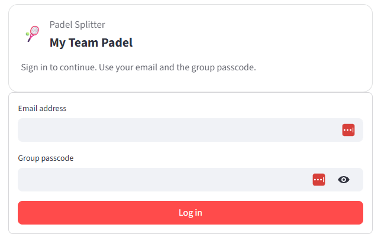
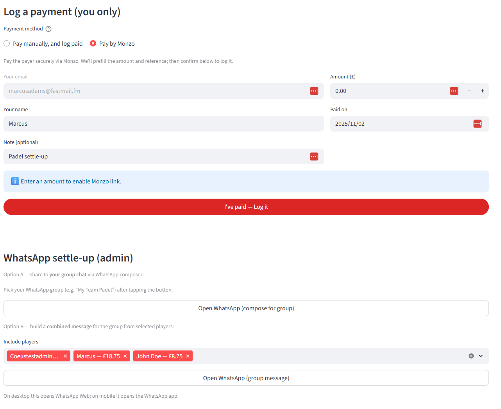
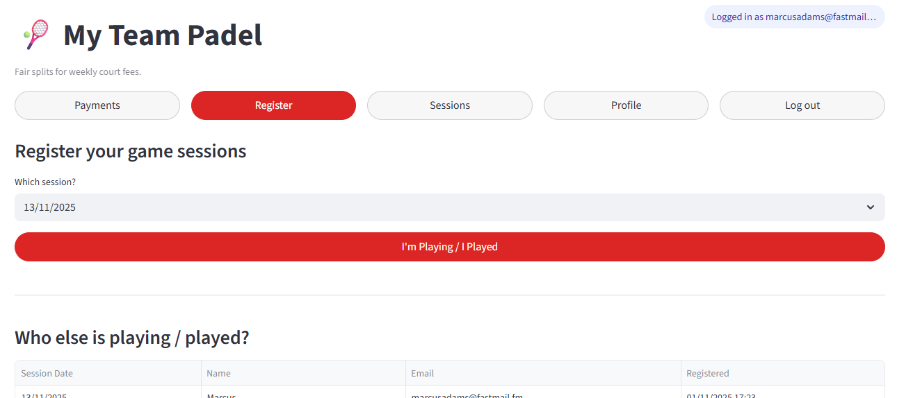
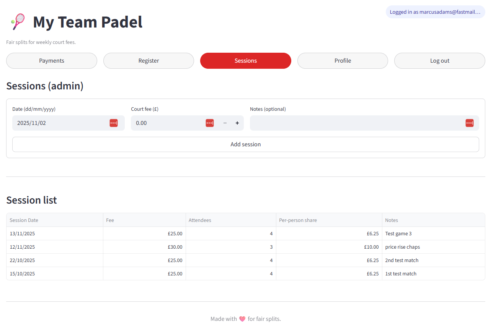
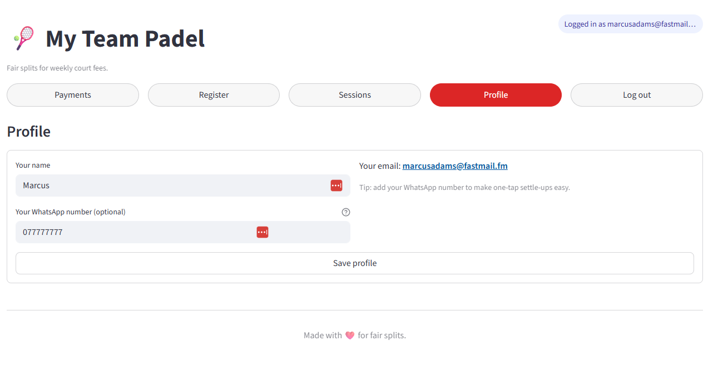

# 🎾 Wainwright Padel Team — Payments App (v1)

[](https://share.streamlit.io/deploy)
[](https://<your-subdomain>.streamlit.app)

A simple Streamlit app that lets a padel group:
- create weekly **sessions** (with total court fee),
- **register** who played,
- auto-split the cost per session,
- let players **log their own payments**, and
- send **one WhatsApp “settle-up”** message (with Monzo payment links) to your group chat.

Data lives in **Google Sheets** so it’s easy to audit, edit, or migrate.

---

## Highlights

- **Meta-driven configuration** in the Sheet (no hard-coding in secrets):
  - `group_name` → app title & WhatsApp messages
  - `payer_email` → who balances settle to
  - `monzo_username` → payer’s Monzo username (`username` or `monzo.me/username`)
  - `join_code` → simple passcode to access the app

- **Pages**
  - **Payments**: current balances, player self-payment (manual or Monzo), WhatsApp settle-up for the group
  - **Register**: players register themselves to sessions
  - **Sessions** (admin): create a session (date, fee, notes), see attendees and per-person share
  - **Profile**: player updates their name and WhatsApp number

- **Monzo-only** payment links (keeps things clean and reliable)
- **WhatsApp group compose**: generate one combined message and send to your existing group chat

---

## 📸 Screenshots

> Add your own screenshots to `docs/screens/` with these filenames, or adjust the paths below.

<p align="center">
  
  
</p>
<p align="center">
  
  
</p>
<p align="center">
  
</p>

**How to capture**  
Use your browser’s screenshot tool (or macOS: `⌘⇧4`, Windows: `Win+Shift+S`) and save to `docs/screens/` with the names above. Commit and push — GitHub will render them in the README.

---

## Architecture

Everything is in a single `app.py`. Data model is five worksheets in one Google Sheet:

### 1) `meta` (configuration)
| key            | value                    | updated_at           |
|----------------|--------------------------|----------------------|
| group_name     | Wainwright Padel Team    | 2025-11-02T10:00:00Z |
| payer_email    | example@domain.com       | 2025-11-02T10:00:00Z |
| monzo_username | monzo.me/yourusername    | 2025-11-02T10:00:00Z |
| join_code      | your-passcode            | 2025-11-02T10:00:00Z |

> **Headers must be exactly** `key | value | updated_at`.

### 2) `sessions`
`[session_id, date, fee, notes, created_at]`
- `session_id` → `YYYY-MM-DD` (same as `date`)
- One row per session (court booking)

### 3) `registrations`
`[session_id, player_email, player_name, registered_at]`
- One row per player per session

### 4) `payments`
`[player_email, player_name, amount, paid_at, note]`
- One row per payment logged by a player

### 5) `players`
`[player_email, player_name, whatsapp, payout_link, active, created_at]`
- `payout_link` is currently unused (kept for future ideas)
- `whatsapp` is used for convenience in messaging

---

## Prerequisites

- A Google account
- A Google Cloud project with a **Service Account** (JSON key)
- A Google Sheet with the tabs above

---

## ⚡ One‑click deploy

1. Click **Deploy to Streamlit** at the top of this README.
2. In the Community Cloud form:
   - **Repository**: your fork of this repo
   - **Branch**: `main`
   - **Main file path**: `app.py`
   - **Python version** (Advanced settings): `3.11` recommended
3. In **Settings → Secrets**, paste the minimal secrets:
   ```toml
   gcp_service_account = """
   { ...full JSON from your Google service account key... }
   """

   [sheets]
   db_key = "YOUR_GOOGLE_SHEET_ID"
   ```
4. Share your Google Sheet with the service account email from the JSON (`client_email`) as **Editor**.
5. Click **Deploy**.

---

## Local Development

```bash
python -m venv .venv
. .venv/bin/activate   # Windows: .venv\Scripts\activate
pip install -r requirements.txt
streamlit run app.py
```

> Python **3.11** recommended.

---

## Using the App

1. Open the app → **Login**
   - Enter your **email** and the `join_code` from the **`meta`** sheet.
2. Go to **Sessions** (admin) → add a session (date, fee).
3. Players go to **Register** → pick a session → **I’m Playing / I Played**.
4. **Payments** page:
   - See **Current balances** (owed = positive; credit = negative)
   - Players can **Pay manually** (and log it) or **Pay by Monzo** (and log it)
   - Admin can generate a **combined WhatsApp settle-up** and send it to the group

---

## Monzo links

The payer’s Monzo username may be entered as:
- `username`
- `monzo.me/username`
- `https://monzo.me/username`

The app normalises this and builds links like:
```
https://monzo.me/<username>/<amount>?d=Padel%20<group_name>
```

---

## Security Notes

- This app uses a **shared passcode** (`join_code`) from the Sheet. It’s meant for **small friendly groups**, not public access.
- Keep your **service account JSON** safe. Do **not** commit it to Git.
- Share the Google Sheet **only** with the service account (and trusted admins).

---

## Troubleshooting

- **“Invalid grant: account not found”**  
  The service account JSON is wrong, or the Sheet isn’t shared with the service account.

- **Quota: 429 Read requests per minute**  
  You’re refreshing too quickly. The app batches reads and caches for short periods, but rapid saves or many concurrent users may hit limits. Try again in a minute.

- **Login card title doesn’t update**  
  Ensure the `meta` tab row is exactly `group_name` (lowercase, underscore). If you changed it moments ago, reload the page. The login screen reads the `meta` sheet freshly.

---

## Version

**v1** (public reset):  
- Meta-driven config (group name, payer email, Monzo username, join code)  
- Payments (Monzo), Register, Sessions, Profile pages  
- WhatsApp group settle-up compose
